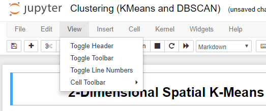

# Hide Jupyter Notebook Cells Individually 

This custom.js script allows you to hide cells (Input Only) of a Jupyter Notebook based on a tag given to the cell without installing any packages or extensions! This uses a simple javascript script to hide desired cells. 

## Setup 

**Custom.js Script**
* Download the script
* Place the custom.js in \.jupyter\custom\ folder which will most likely be located on your main drive. [See Here](https://jupyter-notebook.readthedocs.io/en/stable/examples/Notebook/JavaScript%20Notebook%20Extensions.html#custom.js) for more information
* This should be all good to go!

**Tag Your Code Cells** 
* Open a Jupyter Notebook
 

 

* Click on View in the Top Toolbar, then Click on Cell Toolbar (Image), then choose Tags in the next window.
 

 
* In the blank cell, add **hidecode** unless you altered the script. Click Add Tag for it to be added.
Reload your Jupyter Notebook and the Inputs of cells 

 
Disclaimer: This was for online use, and I did not intend to export a Jupyter Notebook as a different format. This remains untested as of now. Sorry for any inconvenience. 
